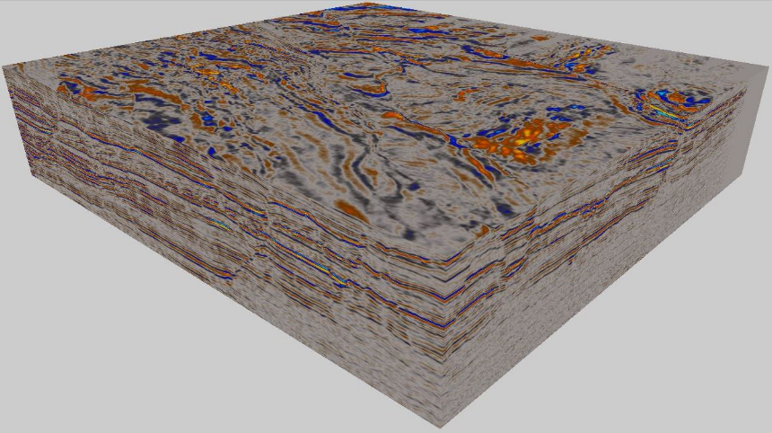

# TopCoder Marathon Match: Fault Detection in a 3D Seismic Volume (3rd place)
([Link to challenge](https://www.topcoder.com/challenges/5863dfd8-f36c-468a-8930-b2bc16b9a92a?tab=details))


The goal of this challenge is to detect and segment faults (curved surfaces) from seismic volume data. My solution is mainly based on point cloud analysis with PCL. The algorithms were developped in C++ and a dockerized version of the code is provided.


                     

The program takes a 3D Fault Likelihood volume as input, transforms it into a point cloud, segments curved surfaces and creates separate meshes.

## Dependencies
- PCL
- Eigen3
- [segyio](https://github.com/equinor/segyio)
- NumPy
- PyMeshFix


## Building and Running Docker version

```bash
 docker build -t image_name .
 docker run -v path_to/training/inputs/:/input -v path_to/results/:/output image_name /input /output
 ```
